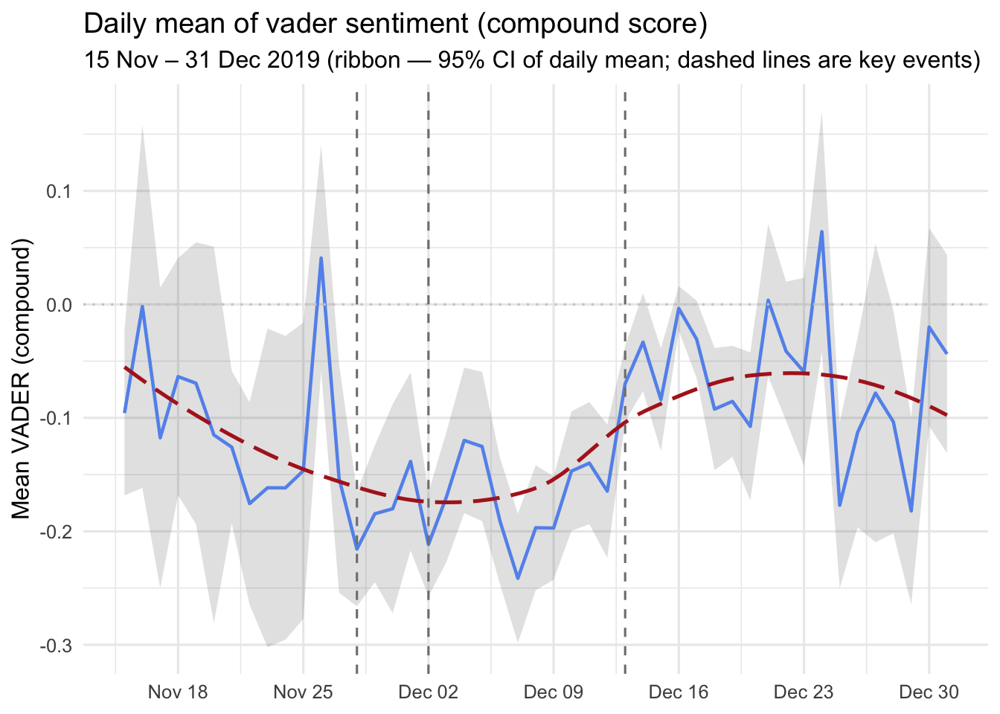
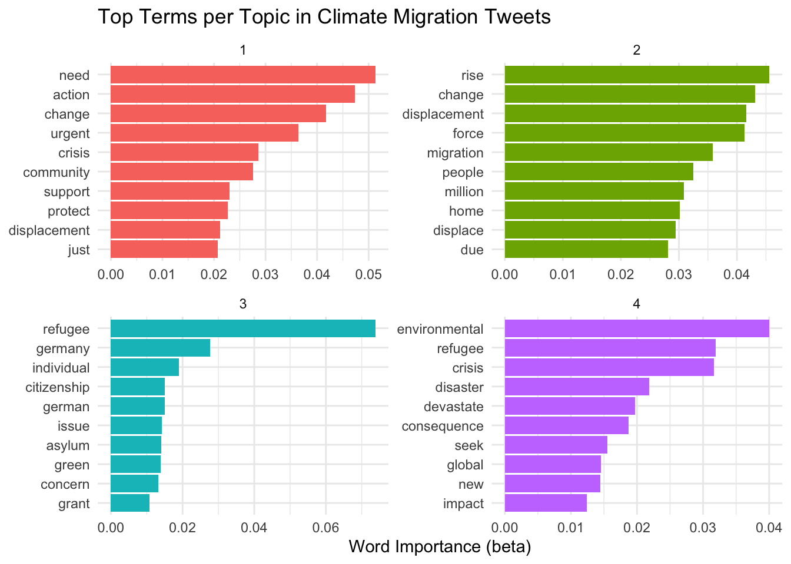

**Tools and skills:** R · text cleaning · sentiment analysis · VADER · NRC emotions · topic modelling · data visualisation

::: {.callout-note}

## At a glance

The project analysed **5,482 climate-migration tweets** using sentiment analysis, emotion analysis, and topic modelling. Four broad themes were identified, while average sentiment remained mostly negative across the study period.

:::

# Project overview
This project analysed how climate migration was discussed on Twitter using quantitative text analysis. We cleaned and explored the tweet corpus, examined hashtags and word associations, tracked sentiment and emotions over time, and used topic modelling to identify the main themes within the conversation.

# Research question
How was climate migration discussed on Twitter, and what sentiments, emotions, and recurring topics shaped the conversation?

# Data
The dataset contained 5,482 anonymised and synthetic tweets about climate migration. The tweets covered the period from 15 November to 31 December 2019 and were originally drawn from German, Spanish, and Dutch language discussions. The retained variables included the tweet date, original language, and anonymized English text.

# Methods
- Cleaned the tweet text by removing placeholders, URLs, retweet markers, and duplicate posts.
- Analysed frequently used hashtags and recurring word combinations.
- Applied VADER to classify tweets as positive, negative, or neutral.
- Checked the VADER classifications against a manually labelled sample of tweets.
- Used the NRC lexicon to examine emotions such as fear, anger, trust, and anticipation.
- Applied Latent Dirichlet Allocation to identify recurring topics in the climate-migration discussion.
- Examined how sentiment and emotions changed during the study period.

# Sentiment over time

{width=90%}

Average sentiment remained mostly negative throughout the period, although it became less negative during parts of December.

# Topic modelling

{width=95%}

The four topics captured distinct parts of the discussion, including urgent climate action, refugee and integration policy, debates about climate migration, and the humanitarian consequences of displacement.

# Key findings
- VADER classified 2,886 tweets as negative, 1,656 as positive, and 940 as neutral.
- Negative sentiment had the largest daily share for most of the period, with peaks in late November and early December. Positive sentiment increased again after approximately 13 December.
- The small neutral category appeared unreliable during manual validation, showing the importance of checking automated sentiment classifications.
- Topic modelling identified four broad themes: urgent calls for climate action, German refugee and integration policy, debate around defining and solving climate-migration issues, and the humanitarian scale of climate displacement.
- Overall, climate migration was discussed as an environmental crisis, humanitarian emergency, policy challenge, and social-justice issue.

# My contribution
I contributed to cleaning and preparing the tweet data, carrying out the topic modelling, and interpreting the resulting themes. I also contributed to writing the final report and explaining the main findings.

# Limitations
The dataset covered a relatively short period and focused on synthetic and anonymised tweets, so the findings should not be treated as a complete picture of public opinion. Automated sentiment tools can also misclassify sarcasm, context, or ambiguous wording. Topic modelling identifies broad patterns, but interpreting and naming the topics still requires human judgement.

# Full project report

[View the original rendered report](../02-working-files/climate-text-analysis-report.html)