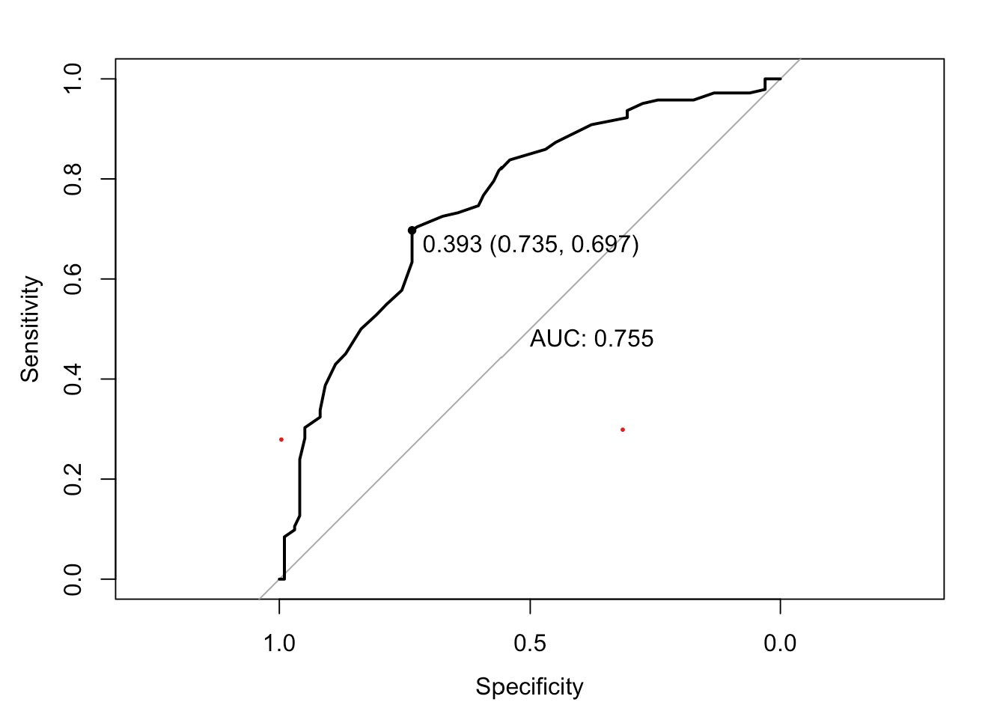
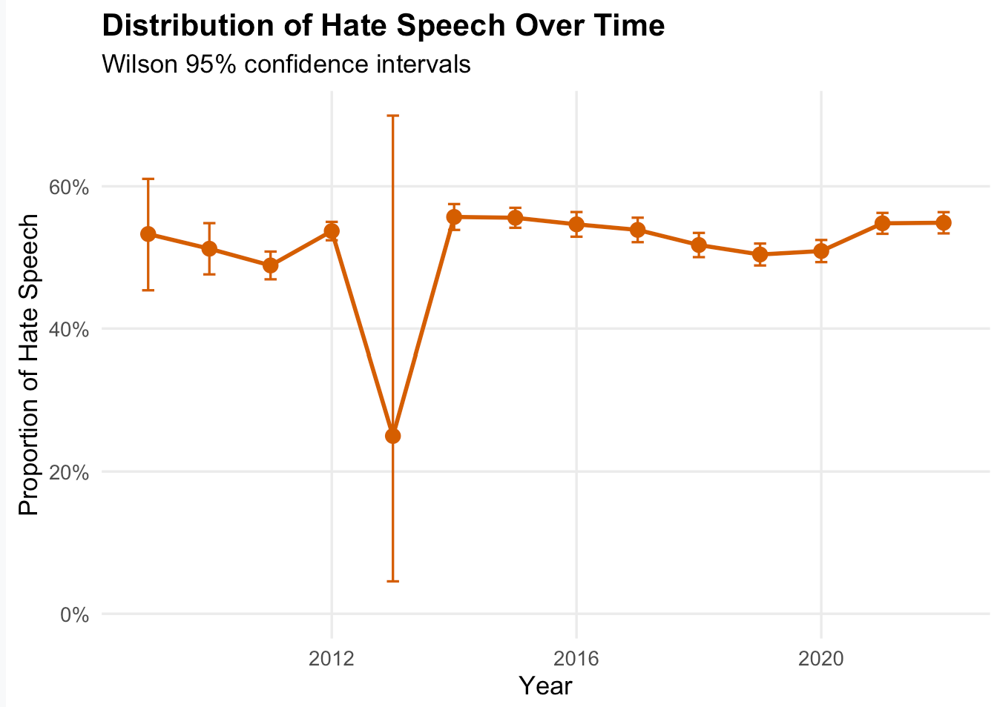

**Tools and skills:** R · data cleaning · manual annotation · text analysis · machine learning · model evaluation · topic modelling

::: {.callout-note}

## At a glance

The selected classifier achieved **70.3% accuracy**, **0.81 precision**, **0.61 recall**, and an **F1-score of 0.70** on the external validation data.

:::

# Project overview
This project examined hate speech within the r/MensRights subreddit using supervised machine learning and topic modelling. We trained classification models on manually labelled Reddit posts, used the selected model to identify hate speech in the wider dataset, and explored the main themes appearing within the classified posts.

# Research question
Can supervised machine-learning models identify hate speech in posts from the r/MensRights subreddit, and what themes characterise the posts classified as hate speech?

# Data
The project used Reddit posts collected from the r/MensRights subreddit. A subset of posts was manually labelled as hate speech or non-hate speech and used to train and evaluate the classification models. The selected model was then applied to the larger unlabelled dataset.

# Methods
- Manually labelled a sample of Reddit posts as hate speech or non-hate speech.
- Assessed agreement between the four coders using pairwise Cohen’s kappa.
- Cleaned and transformed the text using unigram, bigram, and lemmatisation approaches.
- Compared Naive Bayes, logistic regression, and Random Forest classification models.
- Evaluated performance using precision, recall, F1-score, and accuracy.
- Applied topic modelling to explore themes within posts classified as hate speech.
## Model comparison

| Model | Accuracy | Precision | Recall | F1-score |
|---|---:|---:|---:|---:|
| Bernoulli Naive Bayes | 64.6% | 57.4% | 43.9% | 0.496 |
| Logistic Regression | 66.3% | 63.5% | 40.8% | 0.497 |
| **Random Forest** | **71.7%** | **69.7%** | **54.1%** | **0.609** |

Random Forest achieved the strongest overall performance and was selected for further evaluation.

## Model performance

{width=80%}

# Key findings
- The manually labelled dataset contained 1,200 posts: 483 were labelled as hate speech and 717 as non-hate speech.
- On the external validation dataset, the selected classifier achieved 70.3% accuracy, 0.81 precision, 0.61 recall, and an F1-score of 0.70 for hate speech.
- The model was more reliable when identifying a post as hate speech than it was at detecting every hate-speech post.
- Topic modelling was used to investigate the recurring themes within posts classified as hate speech.
## Hate speech over time

{width=85%}

# My contribution
I contributed to cleaning and preparing the Reddit data, manually labelling posts for the training dataset, building and evaluating the classification models, and interpreting the results. I also contributed to writing the final report and explaining the main findings.

# Limitations
The analysis focused on one Reddit community, so the findings may not generalise to other online spaces. Manual labelling also involved subjective judgement, even though agreement between the coders was assessed. The selected model did not identify every hate-speech post, with recall remaining lower than precision, so its classifications should be interpreted cautiously rather than treated as definitive.
# Full project report

[View the original rendered report](../02-working-files/ML_Part_Final.html)