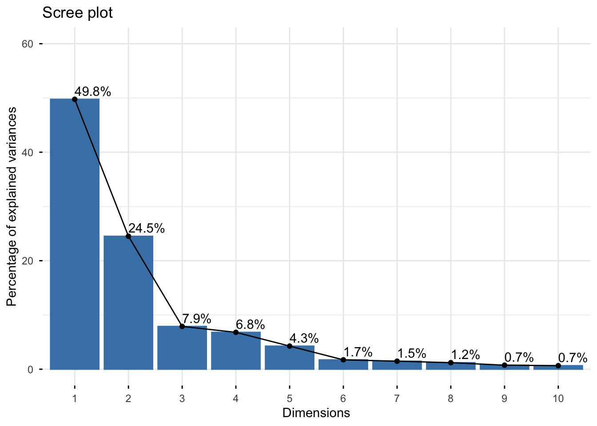
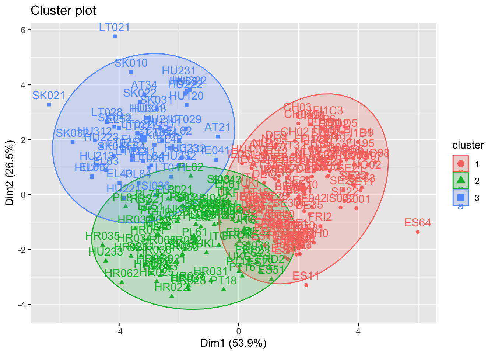

**Tools and skills:** R · data cleaning · exploratory analysis · PCA · clustering · machine learning · model evaluation

::: {.callout-note}

## At a glance

The dataset included **37,775 survey responses**. Lowering the classification threshold increased loneliness recall to approximately **56.5%**, helping the model identify more respondents experiencing loneliness.

:::

# Project overview
This project used survey data to explore patterns in social attitudes and loneliness. We applied principal component analysis and clustering to identify groups with similar characteristics, then compared several machine-learning models to predict whether respondents experienced loneliness.

# Research question
Can survey responses be used to identify distinct groups of respondents and predict whether an individual is experiencing loneliness?

# Data
The dataset contained 37,775 survey responses and included 12 predictor variables plus a binary loneliness outcome. The predictors covered demographic, social, economic, and health-related characteristics. The dataset contained no missing values, but the outcome was imbalanced: approximately 31% of respondents reported loneliness and 69% did not.

# Methods
- Cleaned and prepared the survey variables for analysis.
- Used principal component analysis to reduce the number of dimensions.
- Applied K-means and hierarchical clustering to identify groups of respondents.
- Split the data into training, validation, and test sets.
- Compared logistic regression, Random Forest, and Naive Bayes models.
- Evaluated the models using accuracy, recall, precision, and Cohen’s kappa.
- Adjusted the classification threshold to improve the detection of loneliness.

## Principal component analysis

{width=80%}

## Cluster analysis

{width=90%}

## Model comparison

| Model | Accuracy | Recall | Cohen’s kappa |
|---|---:|---:|---:|
| Random Forest | **72.4%** | 21.2% | 0.209 |
| Logistic Regression | 71.7% | 27.8% | **0.229** |
| Naive Bayes | 68.9% | **38.8%** | 0.228 |

Random Forest achieved the highest accuracy, but Naive Bayes identified a substantially larger proportion of respondents experiencing loneliness. Because missing lonely respondents was considered more serious than generating false positives, recall was prioritised when selecting and tuning the final model.

# Key findings
- Principal component analysis identified three broader dimensions: attitudes toward homosexuality, gender equality, and institutional trust.
- Both clustering approaches retained three groups of regions with different combinations of tolerance, equality attitudes, and institutional trust.
- Random Forest achieved the highest overall accuracy at approximately 72%, but detected only around 21% of respondents experiencing loneliness.
- Naive Bayes had lower accuracy at approximately 69%, but achieved the strongest initial recall at 38.8%.
- Reducing the Naive Bayes classification threshold to approximately 0.20 increased recall to 56.5%, improving the model’s ability to identify loneliness at the cost of more false-positive predictions.

# My contribution
I contributed to cleaning and preparing the survey data, conducting the principal component analysis, and carrying out the clustering analysis. I also evaluated the classification models and contributed to interpreting the results and writing the final report.

# Limitations
The loneliness outcome was imbalanced, with substantially fewer respondents in the positive class. This meant that accuracy alone could give an overly optimistic impression of model performance. Even after threshold adjustment, the selected model still missed some lonely respondents and produced more false-positive classifications. The model should therefore be treated as an exploratory screening tool rather than a reliable basis for individual intervention decisions.

# Full project report

[View the original rendered report](../02-working-files/Group-assignment-1--Machine-learning.html)
