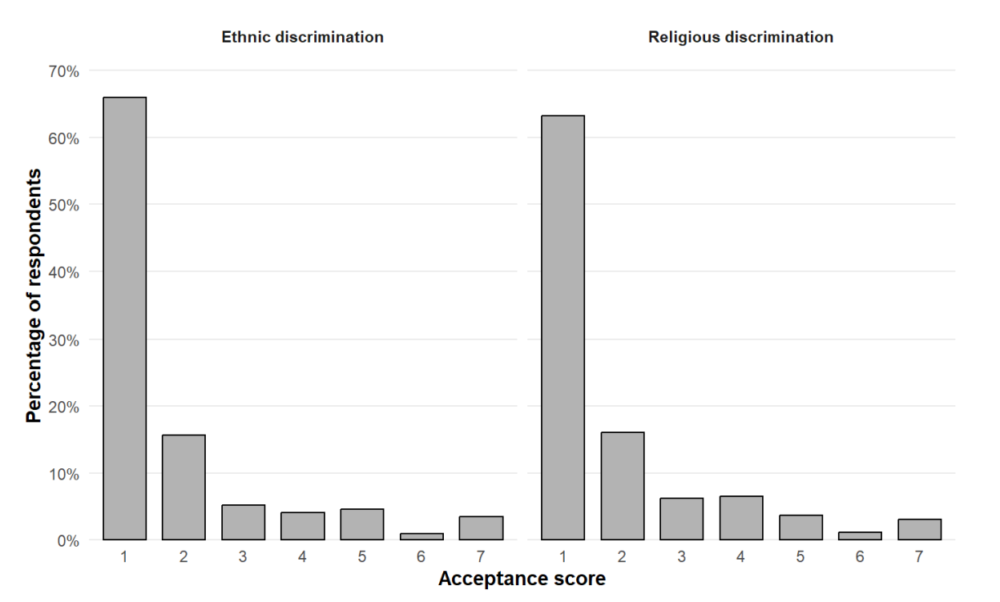

**Tools and skills:** R · survey research · binary logistic regression · ordinal regression · interaction analysis · model comparison · diagnostics · sensitivity analysis · reproducible workflows

::: {.callout-note}

## At a glance

More frequent intergroup contact was consistently associated with **lower acceptance of ethnic and religious discrimination**, while adolescents who reported witnessing discrimination against others had **higher odds of expressing some acceptance** in both domains.

:::

# Project overview

This master’s thesis examined how intergroup contact, discrimination experiences, and migrant background relate to adolescents’ acceptance of ethnic and religious discrimination in Dutch-language Belgian secondary schools.

Rather than treating discrimination as a single construct, I analysed **ethnic and religious discrimination separately**. The study also distinguished between **perceived discrimination**, **vicarious discrimination** (witnessing discrimination directed at others), and **migrant background** as different features of adolescents’ intergroup environments.

The project was an independent secondary analysis conducted under the supervision of **Prof. Dr. David De Coninck** at KU Leuven.

# Research question

**How are migrant background, discrimination experiences, and intergroup contact associated with adolescents’ acceptance of ethnic and religious discrimination?**

The thesis focuses on the **normative evaluation of discriminatory behaviour**: whether adolescents reject unequal treatment completely or regard some degree of ethnic or religious discrimination as acceptable.

# Data

The analysis used survey data from pupils in the third cycle of Dutch-language secondary education in Belgium, primarily adolescents aged 16 to 18.

- **762 respondents** remained after the original data-quality screening.
- The primary controlled models used a common complete-case sample of **517 respondents** in each domain.
- Sensitivity analyses excluding mother’s education increased the analytic sample to **601 respondents**.
- Ethnic and religious discrimination were analysed as parallel but distinct domains.

The survey data were originally collected during school visits between February and April 2025. I re-specified the variables and modelling strategy for the research questions developed in this thesis.

# Measures

The principal variables were:

- **Acceptance of ethnic discrimination**
- **Acceptance of religious discrimination**
- **Ethnic and religious intergroup contact**
- **Perceived ethnic and religious discrimination**
- **Vicarious discrimination**
- **Migrant background**

The original acceptance outcomes were measured on seven-point scales. Because responses were strongly concentrated at complete rejection, the primary models distinguished **complete rejection** from **any degree of acceptance**. I retained the original seven-category outcomes for ordinal sensitivity analyses.

{width=90% fig-align="center"}

# Methods

I developed the analysis as a reproducible R workflow covering data preparation, variable construction, missing-data assessment, model estimation, diagnostics, sensitivity analysis, and reporting.

The main analytical strategy included:

- Separate binary logistic regression models for ethnic and religious discrimination.
- Sequential model specifications followed by controlled main-effects models.
- Interaction models testing whether the association between intergroup contact and acceptance varied by migrant background, perceived discrimination, or vicarious discrimination.
- Likelihood-ratio tests and AIC for model comparison.
- Odds ratios and 95% confidence intervals for interpretation.
- Predicted probabilities and simple slopes for relevant interaction models.
- Controls for gender, age, mother’s education, and school location.

## Model diagnostics

I assessed:

- Multicollinearity using generalized variance inflation factors.
- Functional form by comparing models with and without quadratic terms for continuous predictors.
- Potentially influential observations using Cook’s distance, leverage, and residuals.
- The proportional-odds assumption for the ordinal sensitivity models.

# Main findings

| Predictor | Ethnic discrimination | Religious discrimination |
|---|---:|---:|
| Intergroup contact | **OR = 0.83**, p = .003 | **OR = 0.83**, p = .002 |
| Vicarious discrimination | **OR = 1.98**, p = .002 | **OR = 1.83**, p = .005 |
| Perceived discrimination | OR = 0.96, p = .710 | **OR = 0.75**, p = .023 |
| Migrant background | OR = 1.06, p = .823 | OR = 0.87, p = .561 |

The clearest finding was the consistency of the **intergroup-contact association**. More frequent ethnic contact was associated with lower acceptance of ethnic discrimination, and more frequent religious contact was associated with lower acceptance of religious discrimination.

A second consistent pattern concerned **vicarious discrimination**. Adolescents who reported witnessing or encountering discrimination directed at others had higher odds of expressing some acceptance of discrimination in both domains.

Perceived discrimination showed a less consistent pattern. Perceived religious discrimination was associated with lower acceptance of religious discrimination, while perceived ethnic discrimination was not significantly associated with acceptance of ethnic discrimination.

Migrant background was not significantly associated with either outcome.

# Moderation analyses

The moderation results were limited.

- Migrant background did not significantly moderate the relationship between contact and acceptance in either domain.
- Perceived discrimination did not significantly moderate the contact association.
- Vicarious discrimination moderated the contact association only in the ethnic domain.

The ethnic contact-by-vicarious-discrimination interaction was statistically significant in the primary model, but the result was modest, close to the conventional significance threshold, and did not appear in the religious domain. I therefore treat it as **tentative rather than established**.

# Robustness and sensitivity analysis

I used two main sensitivity strategies.

First, I re-estimated the models without mother’s education, which increased the analytic sample from 517 to 601 respondents. The substantive pattern of the main findings remained similar.

Second, I re-estimated the analyses using **cumulative-link ordinal models** with the original seven-category acceptance outcomes. These models reproduced the central results:

- Contact remained negatively associated with acceptance in both domains.
- Vicarious discrimination remained positively associated with acceptance in both domains.
- Perceived religious discrimination remained negatively associated with religious-discrimination acceptance.
- Migrant background remained non-significant.

These checks reduced concern that the principal conclusions were driven by complete-case sample loss or by dichotomising the acceptance outcomes.

# Interpretation

The findings suggest that adolescents’ normative judgments about discrimination are related not only to their social position but also to the intergroup environments they experience.

The vicarious-discrimination result was particularly important for the questions that emerged from the thesis. Witnessing discrimination might increase awareness of injustice, but repeated exposure in environments where discriminatory behaviour is tolerated could also shape perceptions of what is normal or socially acceptable. The cross-sectional data cannot distinguish between these explanations, making the result a starting point for further research rather than evidence for a specific mechanism.

# Limitations

Several limitations shape how the findings should be interpreted:

- The study is **cross-sectional and observational**, so the estimated relationships cannot establish causal direction.
- The primary models use **complete-case analysis**, which may introduce selection bias if excluded respondents differ systematically from those retained.
- Several constructs rely on relatively broad or single-item measures.
- The measure of vicarious discrimination does not identify the target, type, frequency, severity, or social response surrounding the observed incident.
- Migrant background is represented by a broad binary measure that may conceal meaningful differences in origin, generation, religion, racialisation, and identification.
- School and classroom identifiers were unavailable, so the models could not account for clustering within educational settings.
- The sampling design does not support generalisation to all Belgian adolescents.

# Future research

The thesis points toward several extensions that could move from documenting associations toward testing mechanisms more directly.

Longitudinal and experimental designs could help establish temporal ordering and examine whether changes in contact or discrimination experiences precede changes in attitudes. Richer measures of vicarious discrimination could distinguish exposure accompanied by condemnation from exposure that occurs without meaningful sanction. Future data should also retain school and classroom identifiers so that multilevel models can examine how institutional norms, school composition, and responses to discrimination shape individual attitudes.

More broadly, I am interested in how experiences of unequal treatment are interpreted and how those interpretations shape expectations about fairness, intergroup attitudes, and subsequent responses to institutions.

# My contribution

This was my independent master’s thesis project. I developed the research question and theoretical framework, re-specified the survey variables for the thesis aims, prepared and analysed the data in R, developed the regression and moderation strategy, conducted the diagnostics and sensitivity analyses, interpreted the findings, and wrote the thesis under faculty supervision.

# Full thesis

<!--
To make the thesis available on the site, copy the PDF into your project and update the path below.

[Download the full master’s thesis](../MastersThesis_MoustafaBasiony.pdf)
-->
